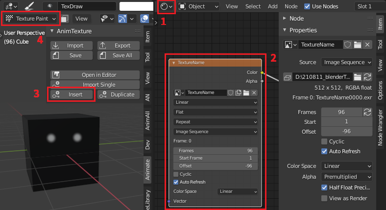

# AnimTexture
(just like AnimAll)

Animate Textures in Blender

"AnimTexture" is a Blender Addon that enables you to do 2d keyframe animation on a texture using an image sequence, utilizing the texture paint function in blender to let you draw on the surface of objects. You can create an image sequence as a texture, add keyframes to the timeline, save, import and export images.

Images are saved as an image sequence.

## Steps

- Open the Material Editor and add an image texture node. Select the node.
- Press the *insert* button in the AnimTexture Tab (3D View > UI Panel).
- file browser and a dialog where you can set the name, file-extension, padding, dimension and color space of the image sequence used for the animation.

- Switch to the texture paint mode and draw.
- Go to another frame and press *insert* again to insert another keyframe.

## Keyframes

To create a duplicate of the keyframe, you can simply duplicate it in the timeline. However, this will be a true duplicate of the keyframe that is linked to it. To be able to independently edit the duplicated image hit the "duplicate" button in the AnimTexture Tab.

## Export and Import

Exporting the image sequence will create an image sequence containing all frames from start to end. Other than just saving the keyframes, this will export holds as multiple images containing the same information. This can be helpful if you want to use the texture without the addon installed.

When importing image sequences the addon will look for duplicate files, trying to supply you only with relevant keyframes.
